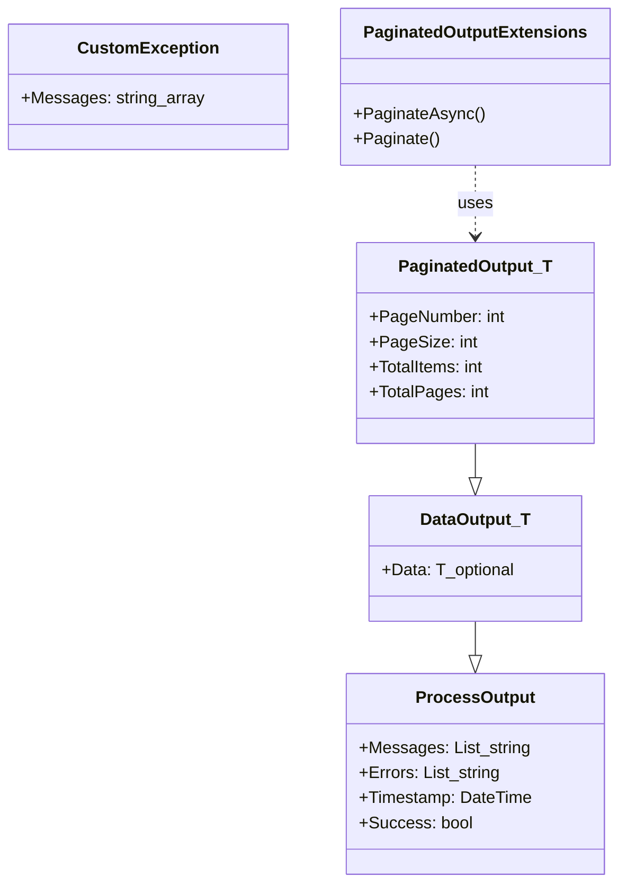

# Dotnet Output

A .NET helper library that standardizes process and data outputs, provides a paginated output container, and
includes IQueryable pagination extension methods (synchronous & asynchronous).

## Contents

- Project overview
- Classes
    - `ProcessOutput`
    - `DataOutput`
    - `PaginatedOutput`
    - `CustomException`
    - `PaginatedOutputExtensions` (extension methods)
- Usage examples
- Add as a Git submodule and reference
- Mermaid class diagram
- Notes

---

## Overview

`ArturRios.Output` provides lightweight types to represent the result of operations in a consistent way. Typical use
cases:

- Return success/failure information together with messages and errors
- Return typed data payloads with fluent helpers
- Return paginated list results and help paginate `IQueryable` sources (works with EF Core or in-memory LINQ)

The library has no external runtime dependencies apart from `Microsoft.EntityFrameworkCore` when you call the EF-aware
`PaginateAsync` extension (the extension is written to work with both IQueryables that support async and ones that
don't).

## Classes

- `ProcessOutput`
    - Purpose: Base container for operation results. Captures messages, errors, timestamp and a convenience `Success`
      flag.
    - Key members:
        - `List<string> Messages { get; }`
        - `List<string> Errors { get; }`
        - `DateTime Timestamp { get; }` (UTC)
        - `bool Success { get; }` (true when no errors)
        - Fluent helpers: `WithError`, `WithErrors`, `WithMessage`, `WithMessages`
        - Add helpers: `AddError`, `AddErrors`, `AddMessage`, `AddMessages`
        - Static factory: `ProcessOutput.New`

- `DataOutput<T>` : `ProcessOutput`
    - Purpose: Holds a typed data payload plus everything `ProcessOutput` provides.
    - Key members:
        - `T? Data { get; protected set; }`
        - Fluent API: `WithData(T)`, `WithError(string)`, `WithErrors(IEnumerable<string>)`,
          `WithMessage(string)`, `WithMessages(IEnumerable<string>)`
        - Static factory: `DataOutput<T>.New`

- `PaginatedOutput<T>` : `DataOutput<List<T>>`
    - Purpose: Represents a paginated result set containing `List<T>` as the payload.
    - Key members:
        - `int PageNumber { get; set; }`
        - `int PageSize { get; }` (derived from Data?.Count)
        - `int TotalItems { get; set; }`
        - `int TotalPages { get; }` (computed as Ceil(TotalItems / PageSize))
        - Helpers to build: `WithPagination(int pageNumber, int totalItems)`, `WithData(List<T>)`, `WithData(T)`,
          `WithEmptyData()`, `AddItem(T)`, `AddItems(IEnumerable<T>)`
        - Fluent `WithMessage` / `WithError` overloads preserved.
        - Static factory: `PaginatedOutput<T>.New`

- `CustomException` (abstract)
    - Purpose: Base exception type wrapping an array of messages. Derive from it to create domain-specific exceptions
      that carry multiple messages.
    - Key members:
        - Constructor that accepts `string[] messages` and builds the base `Exception` message by joining them
        - `string[] Messages { get; }`

- `PaginatedOutputExtensions` (static)
    - Purpose: Extension methods for `IQueryable<T>` to paginate a query and return a `PaginatedOutput<T>`.
    - Methods:
      - `Task<PaginatedOutput<T>> PaginateAsync<T>(this IQueryable<T> query, int pageNumber, int pageSize, Expression<Func<T, object?>>? orderBy = null, CancellationToken cancellationToken = default)`
        - Uses EF Core async if the query provider supports `IAsyncQueryProvider`; otherwise falls back to
        synchronous `ToList()`.
      - `PaginatedOutput<T> Paginate<T>(this IQueryable<T> query, int pageNumber, int pageSize, Expression<Func<T, object?>>? orderBy = null)`
        - Synchronous variant. When provided, `orderBy` is applied.

## Usage examples

### Basic (ProcessOutput / DataOutput)

```csharp
using ArturRios.Output;

// Simple success response with a message
var p = ProcessOutput.New.WithMessage("Operation completed");

// Data output
var d = DataOutput<int>.New
    .WithData(42)
    .WithMessage("Value computed");

if (!d.Success) {
    // inspect d.Errors
}
```

### Paginated example (synchronous)

```csharp
using ArturRios.Output;

IQueryable<MyEntity> query = ...; // your LINQ or EF Core query
int pageNumber = 1;
int pageSize = 20;

var page = query.Paginate(pageNumber, pageSize, e => e.CreatedAt);
// page is PaginatedOutput<MyEntity>
var items = page.Data; // List<MyEntity>
```

### Paginated example (async, EF Core)

```csharp
using ArturRios.Output;

var page = await dbContext.Set<MyEntity>()
    .Where(e => e.IsActive)
    .PaginateAsync(pageNumber: 2, pageSize: 50, orderBy: e => e.CreatedAt, cancellationToken: ct);

var items = page.Data; // List<MyEntity>
```

## How to use in your project

Add as a Git submodule and reference the project in your solution:

```bash
# from your solution repository root
git submodule add <git-url-of-this-repo> external/dotnet-output
git submodule update --init --recursive

# then add the csproj to your solution (adjust path)
dotnet sln add external/dotnet-output/src/ArturRios.Output.csproj
```

This keeps the library as a normal project dependency and allows debugging into its code.

## API notes & gotchas

- `PaginatedOutput.PageSize` is derived from the returned `Data.Count` (i.e., the number of items in the current page).
  `TotalItems` is intended to be the total number of items across all pages. `TotalPages` is computed as
  `Ceiling(TotalItems / PageSize)`.

## Class diagram

Below is a mermaid class diagram representing the public classes in this project. You can paste this into any
mermaid-enabled renderer (for example GitHub markdown with mermaid enabled, or live editors).



## Build, test and publish

Use the official [.NET CLI](https://learn.microsoft.com/en-us/dotnet/core/tools/) to build, test and publish the project and Git for source control.
If you want, optional helper toolsets I built to facilitate these tasks are available:

- [Dotnet Tools](https://github.com/artur-rios/dotnet-tools)
- [Python Dotnet Tools](https://github.com/artur-rios/python-dotnet-tools)

Both of them are compatible with this project structure.
Installation and usage instructions are available in their respective repositories.

## Contributing

Contributions are welcome. For small fixes a PR with tests and a few usage examples is ideal.

---
